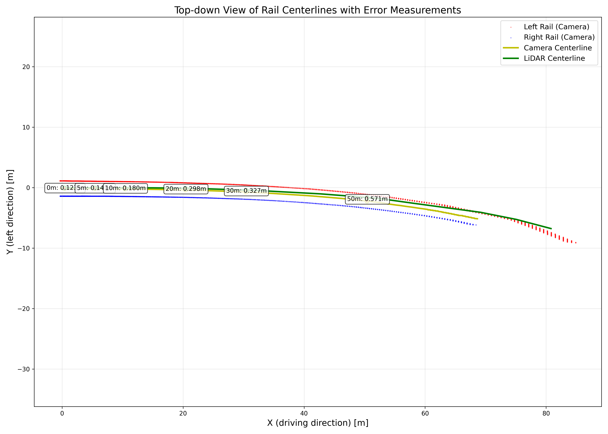
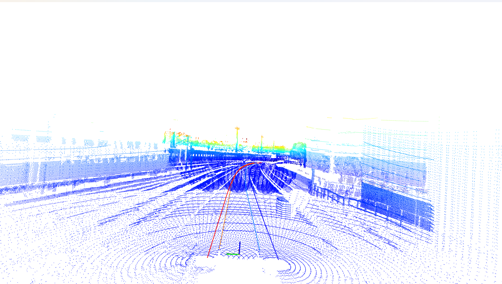

# 3D Rail Detection

A modular Python framework for analyzing rail annotations from camera and LiDAR data. This tool projects 2D rail annotations into 3D space, aligns them with LiDAR data, and calculates metrics for rail centerline accuracy.

## Features

- Load 2D and 3D rail annotations from RailLabel format
- Project 2D rail masks to 3D using inverse projection
- Transform coordinates between camera and LiDAR coordinate systems
- Calculate rail centerlines and error metrics
- Generate detailed visualizations in 2D and 3D
- Measure errors at specific distances along the track

## Implementation

This codebase implements the inverse projection algorithm described in:

Tang, T.; Cao, J.; Yang, X.; Liu, S.; Zhu, D.; Du, S.; Li, Y. A Real-Time Method for Railway Track Detection and 3D Fitting Based on Camera and LiDAR Fusion Sensing. Remote Sens. 2024, 16, 1441. https://doi.org/10.3390/rs16081441

The implementation is designed to work with the RAILDB Dataset:

Roman Tilly, Philipp Neumaier, Karsten Schwalbe, Pavel Klasek, Rustam Tagiew, Patrick Denzler, Tobias Klockau, Martin Boekhoff, Martin Köppel, (2023). Open Sensor Data for Rail 2023 [Data set]. TIB. https://doi.org/10.57806/9mv146r0

## Project Structure

```
rail_analysis/
├── __init__.py
├── main.py
├── modules/
│   ├── __init__.py
│   ├── projection.py       # Projection and coordinate transforms
│   ├── data_loading.py     # Data loading functions
│   ├── visualization.py    # Visualization functions
│   ├── evaluation.py       # Error calculation functions
│   └── utils.py            # Utility functions
```

## Requirements

- Python 3.8+
- NumPy
- OpenCV
- Open3D
- Matplotlib
- SciPy
- RailLabel
- Click

## Usage

Run the main script with file paths as command-line arguments:

```bash
python main.py --scene-pcd example/673_1631705207.399811000.pcd --labels example/7_approach_underground_station_7.2_labels.json --image example/673_1631705207.400000024.png
```

You can also use the shorter option names:

```bash
python main.py -s path/to/point_cloud.pcd -l path/to/labels.json -i path/to/image.png
```

### Customization

You can modify camera parameters, height, and other settings in the main.py file. 

## Results

This section shows sample results from the rail analysis:



### Error Measurements at Specific Distances:

| Distance (m) | Total Error (m) | Lateral Error (m) | Vertical Error (m) | In Bounds |
|--------------|-----------------|-------------------|-------------------|-----------|
| 0            | 0.123           | 0.122             | 0.018             | Yes       |
| 5            | 0.141           | 0.141             | 0.006             | Yes       |
| 10           | 0.180           | 0.179             | 0.023             | Yes       |
| 20           | 0.298           | 0.298             | 0.018             | Yes       |
| 30           | 0.327           | 0.326             | 0.015             | Yes       |
| 50           | 0.571           | 0.571             | 0.012             | Yes       |

The table shows increasing error with distance from the camera, with the lateral component being the primary contributor to total error. 


Red and blue lines represent projected polylines from camera data, while orange and light blue lines show ground truth from annotaion.

